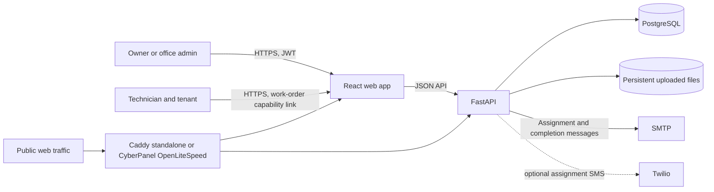

# ReadyRentals Maintenance

ReadyRentals Maintenance manages property maintenance work orders from office assignment through technician completion, tenant and technician sign-off, PDF generation, and office notification.

## Contents

- [System overview](#system-overview)
- [Capabilities](#capabilities)
- [Repository layout](#repository-layout)
- [Run locally](#run-locally)
- [Production deployment](#production-deployment)
- [Backups and recovery](#backups-and-recovery)
- [Security and operations](#security-and-operations)
- [Project documentation](#project-documentation)
- [Support and attribution](#support-and-attribution)

## System overview



The standalone production stack runs Caddy, the frontend, API, and PostgreSQL with Docker Compose. Caddy is the only service publishing host ports in standalone mode. PostgreSQL and the API stay on private Docker networks. PostgreSQL data, uploaded files, and Caddy state use named volumes. The browser frontend and API use separate HTTPS hostnames. For CyberPanel mode, OpenLiteSpeed owns public ports and the Compose override publishes only loopback ports for the app and API.

## Capabilities

| Area | What it supports |
| --- | --- |
| Office access | JWT sign-in; owner and admin roles; owner-managed admin accounts |
| Work orders | Create with optional task-level before photos, filter, view, edit while assigned, resend or regenerate technician links, and move work orders to the owner-managed recycle bin |
| Field workflow | Capability-link access, work start, progress saving, checklist item resolution, required before photos for new tasks, before/after photos, inspection, and signatures |
| Sign-off | Tenant signs before technician; signed work orders get a generated PDF and completion email |
| Administration | Owner-only work-order restore/permanent deletion and audit log; checklist category archive/reactivation |
| Notifications | SMTP email; optional Twilio technician assignment SMS; manual sharing remains available |
| Service targets | Emergency 4 h, urgent 24 h, standard 72 h; elapsed work duration and overdue filters are tracked |

The capability URL grants access to its work order. Treat it as a secret. Regenerating the link invalidates the previous token.

## Repository layout

| Path | Purpose |
| --- | --- |
| `backend/` | FastAPI application, SQLModel entities, Alembic migrations, PDF/email services, and API tests |
| `frontend/` | React 18, TypeScript, and Vite office and field interfaces |
| `ops/` | VPS backup script and systemd timer/service examples |
| `compose.production.yaml` | Production services, networks, health checks, and persistent volumes |
| `compose.cyberpanel.yaml` | Loopback-only frontend/API ports for CyberPanel/OpenLiteSpeed reverse proxying |
| `Caddyfile` | HTTPS reverse proxy configuration |
| `.env.production.example` | Production configuration template; copy to the ignored `.env.production` |
| `ReadyRentals_Client_Handover.docx` | Client handover and operational guidance |

## Run locally

Prerequisites: Python 3.11, Node.js 22 with npm, and the native Pango/Cairo dependencies needed by WeasyPrint (or use the backend Docker image for PDF support).

1. Start the API:

   ```bash
   cd backend
   python -m venv .venv
   # Activate the virtual environment for your shell, then:
   pip install -r requirements-dev.txt
   cp .env.example .env
   alembic upgrade head
   uvicorn app.main:app --reload
   ```

   On Windows PowerShell, copy `.env.example` to `.env` with `Copy-Item`. The API defaults to `http://127.0.0.1:8000`; interactive OpenAPI docs are at `/docs`.

2. Start the frontend in another terminal:

   ```bash
   cd frontend
   npm ci
   cp .env.example .env
   npm run dev
   ```

   On Windows PowerShell, use `Copy-Item .env.example .env`. Vite serves the app at `http://localhost:5173`. `VITE_API_BASE_URL` is compiled into the frontend build; local default is `http://127.0.0.1:8000`.

3. Register the first owner with the local `OWNER_CODE` from `backend/.env`, then sign in. Set a private, unique `JWT_SECRET` and `OWNER_CODE` before exposing a shared environment. The local configuration uses SQLite and log email by default.

## Production deployment

The production deployment is the root Compose stack on a Linux VPS with Docker Engine and the Compose plugin. Choose one public web entry point: Caddy (standalone mode) or CyberPanel/OpenLiteSpeed (see [CyberPanel deployment guide](CYBERPANEL_DEPLOYMENT_GUIDE.md)).

1. Point DNS for the app and API domains to the VPS. Permit inbound TCP ports 80 and 443; UDP 443 is optional for HTTP/3.
2. Copy the repository to the server and configure the private environment file:

   ```bash
   cp .env.production.example .env.production
   # Edit .env.production; replace example domains and all CHANGE_ME values.
   ```

   Use independent random values for `POSTGRES_PASSWORD`, `JWT_SECRET`, and `OWNER_CODE`. Configure real SMTP credentials. The Twilio variables are optional; leave them blank to disable SMS.
3. For a VPS without CyberPanel, start and inspect the standalone Caddy stack from the repository root:

   ```bash
   docker compose --env-file .env.production -f compose.production.yaml --profile standalone up -d --build
   docker compose --env-file .env.production -f compose.production.yaml --profile standalone ps
   docker compose --env-file .env.production -f compose.production.yaml --profile standalone logs -f --tail=100
   ```

4. Open `https://<DOMAIN>`, register the first owner, then verify `https://<API_DOMAIN>/health` returns `{"status":"ok"}`.

Caddy obtains and renews certificates for publicly resolvable domains. Compose applies Alembic migrations when the API container starts. Review migration and API logs after deployments. **Do not run `docker compose down -v` on a live deployment:** it deletes persistent database, upload, and Caddy volumes.

When CyberPanel/OpenLiteSpeed owns ports 80 and 443, follow [CyberPanel deployment guide](CYBERPANEL_DEPLOYMENT_GUIDE.md) instead. That mode leaves Caddy stopped and publishes only the frontend and API on loopback ports for OpenLiteSpeed to proxy; PostgreSQL stays private.

Production settings and descriptions are in [.env.production.example](.env.production.example). Do not commit `.env.production` or share it in support requests.

### SMS delivery

The assignment SMS contains the technician's capability link. For US local long-code numbers, Twilio requires A2P 10DLC registration; trial accounts restrict recipients to verified numbers. An accepted or queued message is not proof of delivery. The application does not currently process delivery callbacks, so verify delivery in Twilio Console and provide the share link through another channel when needed.

## Backups and recovery

[`ops/backup-production.sh`](ops/backup-production.sh) creates a PostgreSQL custom-format dump, an archive of the uploads volume, and SHA-256 checksums. It briefly stops the API to keep the database and uploads consistent, then restarts it. It keeps a local cache (14 days by default). If Restic is configured, it sends an encrypted off-site copy before pruning local backups; without Restic, the backup exists only on the VPS. For CyberPanel deployments, set `CYBERPANEL_MODE=true` in the backup service environment so the script uses both Compose files when restarting the API.

The `ops/readyrentals-backup.service` and `.timer` files show how to schedule the backup with systemd. Review the script and handover guide before enabling it, configure off-site credentials and retention, monitor failures, and perform a restore drill. A backup is not verified until the database and files have both been restored and checked.

## Security and operations

- Keep `.env.production`, database credentials, JWT signing keys, SMTP/Twilio credentials, and backup encryption credentials private.
- Restrict server access and keep Docker, the operating system, and the application images updated.
- Protect technician links like passwords. Anyone with a link can use its work-order capability until it is regenerated or the order is deleted.
- Configure `CORS_ORIGINS` only for trusted frontend origins. Production Compose sets it from `DOMAIN`.
- Production Compose disables FastAPI's interactive `/docs`, `/redoc`, and `/openapi.json` endpoints by default. Set `API_DOCS_ENABLED=true` only when public API documentation is intended, then recreate the API container.
- In standalone mode, only Caddy publishes public ports. In CyberPanel mode, only the frontend/API loopback mappings are published for OpenLiteSpeed; keep the API and PostgreSQL off public host ports.
- Check API health, container logs, SMTP delivery, and Twilio delivery in their respective consoles.
- SMS is optional and must not be the sole handoff channel for technician links.

## Project documentation

- [Backend guide](backend/README.md): API routes, permissions, lifecycle, environment, migrations, and backend development.
- [Frontend guide](frontend/README.md): application routes, frontend development, and production build behavior.
- [CyberPanel deployment guide](CYBERPANEL_DEPLOYMENT_GUIDE.md): CyberPanel installation preparation, WordPress migration, Docker Compose, OpenLiteSpeed proxy, email, DNS, and backups.
- [HostGator migration plan](HOSTGATOR_VPS_MIGRATION_PLAN.md): hosting choices and the migration/rollback strategy for the VPS, WordPress sites, and mailboxes.
- [Client handover and operations guide](ReadyRentals_Client_Handover.docx): client-facing workflow and operational procedures.

## Support and attribution

Developed for [ReadyRentalsOnline](https://readyrentalsonline.com) by Muhammad Attayab Ashraf and [Automivex](https://www.automivex.com).

- Developer: [attayabpc2@gmail.com](mailto:attayabpc2@gmail.com) · [+92 317 4026038](tel:+923174026038)
- Automivex: [social@automivex.com](mailto:social@automivex.com)

For support, include the deployment version or commit, relevant environment details, and reproduction steps. Redact passwords, tokens, private environment values, and technician links from logs and examples.
