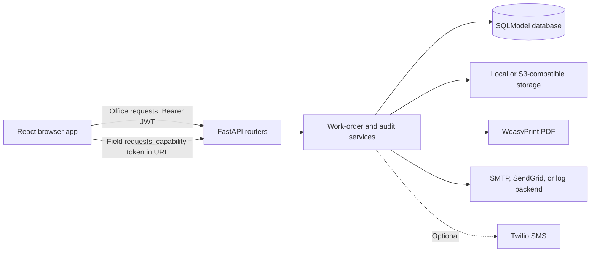

# ReadyRentals Maintenance API

The backend is a FastAPI application backed by SQLModel and Alembic. It provides office authentication and administration, work-order APIs, token-based field workflows, uploaded-file storage, PDF generation, email/SMS notifications, and owner-visible audit history.

## Contents

- [Architecture](#architecture)
- [Work-order lifecycle](#work-order-lifecycle)
- [API and access](#api-and-access)
- [Local development](#local-development)
- [Configuration](#configuration)
- [Database and migrations](#database-and-migrations)
- [Tests](#tests)
- [Production deployment](#production-deployment)

## Architecture



The production Compose stack runs PostgreSQL and local upload storage on persistent volumes. The API runs Alembic migrations at startup. In development the default database is a local SQLite file. WeasyPrint requires Pango/Cairo libraries; the backend Docker image installs the libraries needed for PDF rendering.

## Work-order lifecycle

```mermaid
stateDiagram-v2
    [*] --> assigned: Office creates work order
    assigned --> in_progress: Technician starts
    in_progress --> in_progress: Save progress, item updates, photos
    in_progress --> completed_pending_signoff: All items resolved and completion recorded
    completed_pending_signoff --> completed_pending_signoff: Tenant signs
    completed_pending_signoff --> signed_off: Technician signs after tenant
    signed_off --> [*]: PDF finalized; completion email queued
```



Only these four persisted statuses are defined. An incomplete job remains `in_progress` and can be saved for later; the application does not define an `incomplete_needs_return` status. Starting is allowed only from `assigned`. Item edits and photo uploads require `in_progress`. Completion requires every item resolved, a before and after photo (or explicit “no picture” choice) for each item, an answer for whole-property inspection, and inspection results. Signatures are accepted after completion, tenant first and technician second. Once both are saved, the API finalizes the PDF and queues completion email; writes are locked for `signed_off` orders. The worker token can still read and download the finalized order.

Priority SLA targets are stored in the `priorities` table and seeded as follows:

| Priority | Target |
| --- | ---: |
| Emergency | 4 hours |
| Urgent | 24 hours |
| Standard | 72 hours |

The targets drive overdue filtering and the duration/target result in work-order responses and PDFs. Default checklist categories are seeded by `app/seed.py`; archived categories remain in historical items and can be reactivated by creating a category with the same name.

## API and access

Interactive OpenAPI documentation is available at `/docs` when the API is running. Routes below are relative to the API origin.

| Method and path | Access | Purpose |
| --- | --- | --- |
| `GET /health` | Public | Health response |
| `POST /auth/login` | Public | Exchange office credentials for JWT |
| `POST /auth/register-owner` | Public, owner code required | Register the initial owner; registration is available only while no owner exists |
| `GET /auth/me` | Office JWT | Current account |
| `GET /admins` | Owner JWT | List office accounts |
| `POST /admins` | Owner JWT | Create an admin account |
| `DELETE /admins/{admin_id}` | Owner JWT | Delete an admin; created orders are reassigned to owner |
| `GET /audit-logs`, `GET /audit-logs/stats` | Owner JWT | Query audit entries and statistics |
| `GET, POST /checklist-categories` | Office JWT | List active categories or create/reactivate a category |
| `DELETE /checklist-categories/{category_id}` | Office JWT | Archive a category |
| `POST /work-orders` | Office JWT | Create an order and schedule initial worker notification |
| `GET /work-orders` | Office JWT | List/filter orders |
| `GET /work-orders/{id}` | Office JWT | Read an order |
| `PATCH /work-orders/{id}` | Office JWT | Update an order while its status is `assigned` |
| `DELETE /work-orders/{id}` | Office JWT, role rules apply | Delete order and associated stored files |
| `GET /work-orders/{id}/pdf` | Office JWT | Download the current generated PDF |
| `POST /work-orders/{id}/resend` | Office JWT | Resend assignment notification where configured |
| `POST /work-orders/{id}/regenerate-link` | Office JWT | Rotate worker capability token; invalidates the previous link |
| `POST /work-orders/{id}/send-email` | Office JWT | Re-send finalized report; optional `to_email` override |
| `GET /wo/{token}` | Capability token | Read worker-safe work-order view |
| `POST /wo/{token}/start` | Capability token | Start assigned work |
| `PATCH /wo/{token}/items/{item_id}` | Capability token | Update task notes, resolution, category, or photo skip flags |
| `POST /wo/{token}/items/{item_id}/photo?slot=before\|after` | Capability token | Upload PNG, JPEG, or WEBP photo up to `MAX_UPLOAD_MB` |
| `DELETE /wo/{token}/items/{item_id}/photo?slot=before\|after` | Capability token | Remove an uploaded photo |
| `POST /wo/{token}/progress` | Capability token | Save inspection progress |
| `POST /wo/{token}/complete` | Capability token | Record completion and enter sign-off |
| `POST /wo/{token}/sign` | Capability token | Save tenant/technician signature and finalize after both |
| `GET /wo/{token}/pdf` | Capability token | Download the current PDF |

Office routes require a bearer JWT. Owner-only operations are distinct from routes available to both owner and admin. The field API uses a high-entropy capability token rather than a user account; keep links private. Configure explicit trusted origins in `CORS_ORIGINS` for browser access.

Work-order list filters include `status`, `overdue`, `date_from`, `date_to`, `address`, and `assigned_by_id`. Audit-log filters include actor, role, action, entity type, search text, date range, and pagination. See `/docs` for request/response schemas and validation details.

## Local development

Prerequisites: Python 3.11. From this directory:

```bash
python -m venv .venv
# Activate the virtual environment, then:
pip install -r requirements-dev.txt
cp .env.example .env
alembic upgrade head
uvicorn app.main:app --reload
```

In Windows PowerShell, use `Copy-Item .env.example .env` and activate with `.\.venv\Scripts\Activate.ps1`. The API listens at `http://127.0.0.1:8000`; OpenAPI is at `/docs`. Ensure `CORS_ORIGINS` includes the frontend origin, normally `http://localhost:5173`.

On Debian/Ubuntu, install the Pango/Cairo system libraries for local WeasyPrint rendering; the Dockerfile is the reference for required packages. On Windows, use the backend Docker image for PDF support or install the GTK runtime required by WeasyPrint. The backend's local defaults use SQLite, local disk storage, and log-only email. Configure local SMTP or Twilio only when needed.

## Configuration

The local template is [`.env.example`](.env.example). Production configuration is held at the repository root in [`.env.production.example`](../.env.production.example). Settings are loaded from environment variables and `.env`; unknown values are ignored.

| Variable | Purpose |
| --- | --- |
| `DATABASE_URL` | SQLModel database URL; SQLite locally, PostgreSQL in production |
| `JWT_SECRET`, `JWT_ALGORITHM`, `JWT_EXPIRE_MINUTES` | Office JWT signing and expiry |
| `OWNER_CODE`, `OWNER_EMAIL`, `OWNER_NAME` | Initial owner registration settings |
| `PUBLIC_BASE_URL`, `FRONTEND_BASE_URL` | Public API and frontend origins used to create/share field links |
| `CORS_ORIGINS` | Comma-separated browser origins allowed by CORS |
| `API_DOCS_ENABLED` | Enables `/docs`, `/redoc`, and `/openapi.json`; defaults to enabled locally and production Compose disables it unless explicitly set to `true` |
| `STORAGE_BACKEND`, `STORAGE_LOCAL_DIR` | Select local storage or S3-compatible storage and local path |
| `S3_BUCKET`, `S3_REGION`, `S3_ENDPOINT_URL`, `S3_ACCESS_KEY_ID`, `S3_SECRET_ACCESS_KEY`, `S3_PUBLIC_BASE_URL` | Optional S3-compatible storage settings |
| `MAX_UPLOAD_MB` | Maximum accepted image upload size |
| `EMAIL_BACKEND` | `log`, `smtp`, or `sendgrid` |
| `MAIL_FROM`, `MAIL_FROM_NAME` | Outgoing email sender identity |
| `SMTP_HOST`, `SMTP_PORT`, `SMTP_USER`, `SMTP_PASSWORD`, `SMTP_STARTTLS`, `SMTP_SSL` | SMTP transport settings |
| `SENDGRID_API_KEY` | SendGrid credential when that backend is selected |
| `TWILIO_ACCOUNT_SID`, `TWILIO_AUTH_TOKEN`, `TWILIO_FROM_NUMBER` | Optional SMS assignment notifications |
| `COMPANY_NAME`, `COMPANY_PHONE`, `COMPANY_EMAIL`, `COMPANY_WEBSITE` | Company branding on generated reports and messages |

Use unique random JWT and owner-registration secrets outside isolated local development. Never commit `.env` files or paste secrets and capability links into logs, tickets, or source control.

## Database and migrations

Alembic migrations live under [`alembic/versions/`](alembic/versions/). The backend Docker container runs `alembic upgrade head` before starting Uvicorn. For local development, run `alembic upgrade head` explicitly after configuring the database URL. The application also creates missing tables and seeds lookup data at startup for development convenience; migrations remain the production schema-change mechanism.

Core entities are users, priorities, checklist categories, work orders, work-order items, and audit logs. See [`app/models.py`](app/models.py) and migration history for exact columns and constraints.

## Tests

Tests use pytest with an in-memory SQLite database and exercise authentication, lifecycle rules, role permissions, audit logs, file cleanup, PDF/email behavior, and notifications. Run from this directory:

```bash
pytest -q
```

## Production deployment

Run production with the root Compose files, not from `backend/`. Follow the [root production deployment guide](../README.md#production-deployment) for standalone Caddy or the [CyberPanel deployment guide](../CYBERPANEL_DEPLOYMENT_GUIDE.md) for OpenLiteSpeed. Compose supplies PostgreSQL, persistent uploads storage, explicit CORS/frontend URLs, and SMTP configuration. The API health check is on `/health`. In CyberPanel mode, OpenLiteSpeed proxies HTTPS to the API's loopback-only port; in standalone mode, Caddy proxies HTTPS. Production disables interactive API documentation by default with `API_DOCS_ENABLED=false`.

The root [backup script](../ops/backup-production.sh) captures a PostgreSQL dump and the uploads volume. Read the [backup and recovery guidance](../README.md#backups-and-recovery) and client handover document before scheduling it.
