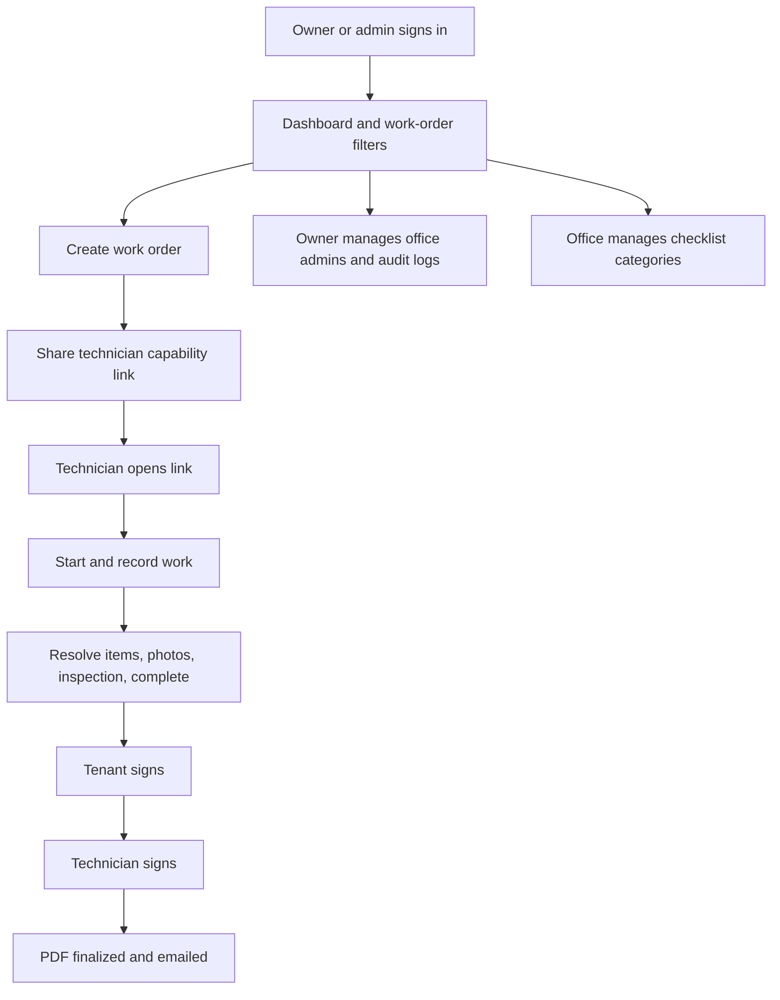

# ReadyRentals Maintenance frontend

The frontend is a responsive React 18 and TypeScript application built with Vite. It provides an authenticated office console and a public technician/tenant workflow opened through a per-work-order capability link.

## Contents

- [User journeys](#user-journeys)
- [Routes](#routes)
- [Development](#development)
- [Build and deployment](#build-and-deployment)
- [Configuration](#configuration)
- [Related documentation](#related-documentation)

## User journeys



Office routes require a valid office JWT. Owner-only controls are enforced by the API as well as the interface. The `/wo/:token` field route does not require an office login; possession of its token grants work-order access, so share it privately. The API is the source of truth for workflow state and permission checks.

## Routes

| Route | Audience | Purpose |
| --- | --- | --- |
| `/login` | Owner, admin | Sign in to the office application |
| `/dashboard` | Owner, admin | View and filter work orders |
| `/work-orders/new` | Owner, admin | Create a work order with optional before photos for tasks and share its technician link |
| `/work-orders/:id` | Owner, admin | Review and manage a work order |
| `/recycle-bin` | Owner | Filter deleted work orders, restore them, or permanently delete them |
| `/settings/categories` | Owner, admin | Create and archive checklist categories |
| `/settings/admins` | Owner | Manage office admin accounts |
| `/audit-logs` | Owner | Review audit history and statistics |
| `/settings/audit-logs` | Owner, admin | Redirect to `/audit-logs` |
| `/wo/:token` | Technician, tenant | Complete field work and sign off |

The frontend uses React Query for server state and React Router for navigation. A small set of shared components and CSS modules support the dashboard, work-order views, audit log, and mobile field workflow.

## Development

Prerequisites: Node.js 22 and npm. Start the FastAPI backend first; setup instructions are in the [backend guide](../backend/README.md).

```bash
cp .env.example .env
npm ci
npm run dev
```

In PowerShell, use `Copy-Item .env.example .env`. Vite serves the application at `http://localhost:5173`. The API must allow that origin in `CORS_ORIGINS`; the backend's local `.env.example` already includes both common localhost origins.

`VITE_API_BASE_URL` selects the API origin and defaults to `http://localhost:8000`. Vite embeds this value in the bundle at build time. Worker links use the frontend origin and `/wo/{token}`; share the complete URL shown by the app.

## Build and deployment

```bash
npm run build
npm run preview
```

`npm run build` runs TypeScript's no-emit check and creates the production bundle in `dist/`. The production Docker image builds the bundle with Node 22 and serves it from Nginx. Nginx falls back to `index.html` for client-side routes.

Production deployment is managed by the root [`compose.production.yaml`](../compose.production.yaml), which passes `VITE_API_BASE_URL` as a Docker build argument. Deploy the full stack from the repository root using the [root deployment guide](../README.md#production-deployment). Rebuild the frontend image when the API hostname changes.

The web app includes a PWA manifest to support adding it to a phone's home screen. It does not implement an offline cache; screens require a live API connection.

## Configuration

| Variable | Default | Description |
| --- | --- | --- |
| `VITE_API_BASE_URL` | `http://localhost:8000` | FastAPI base URL embedded in the frontend build |

See [`frontend/.env.example`](.env.example) for the local template. Production sets this value through Compose and does not require a runtime frontend `.env` file.

## Related documentation

- [Repository and production operations guide](../README.md)
- [Backend API and development guide](../backend/README.md)
- [Client handover and operations guide](../ReadyRentals_Client_Handover.docx)
